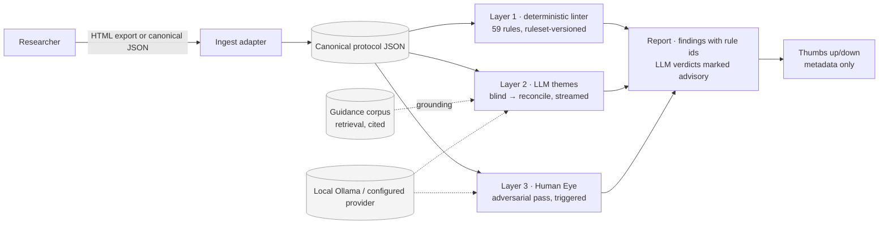

# EtiqTech

AI-powered ethics review pipeline for animal research protocols (IACUC).
Parses institutional HTML exports into structured JSON, lints against
Israeli animal welfare law, and optionally verifies with a local LLM.

Evaluating it for your institution? Read [docs/START-HERE.md](docs/START-HERE.md): one page on
what it is, where the data goes, what it costs to run, and a five-minute linter-only walk-through.

> **Disclaimer**: This tool is provided **as-is** for research and educational
> purposes only. It is **not** a substitute for professional legal, veterinary,
> or regulatory advice. The authors accept no responsibility for decisions made
> based on its output. Always consult your institutional IACUC committee and
> qualified personnel before submitting or approving animal research protocols.

---

## Quick Start

### Docker (recommended)

```bash
docker build -t etiqtech .
docker run -p 4242:4242 etiqtech
```

Open http://localhost:4242 — upload an HTML protocol export and get instant results.

The image serves with `gunicorn -c gunicorn.conf.py`: **one worker, 64 threads**.
Sessions and rate-limit counters live in process memory, so the app must not be
run with several workers (the SSE stream would land on a process that never saw
the upload). Each LLM stream holds a thread, so `GUNICORN_THREADS` is the ceiling
on concurrent streams. Scale by running one container per replica; see
`gunicorn.conf.py` for the shared-store path if that ever changes.

Behind a reverse proxy (the recommended deployment: Cloudflare Access in front),
set `PROXY_FIX=1` so rate limits apply per client IP instead of per proxy.

To connect a local Ollama instance for LLM verification:

```bash
docker run -p 4242:4242 \
  -e OLLAMA_BASE_URL=http://host.docker.internal:11434 \
  etiqtech
```

### Linter-only / public demo

```bash
docker run -p 4242:4242 -e ETIQTECH_LLM_DISABLED=1 etiqtech
```

No GPU or Ollama needed: Layer 1 runs, the LLM controls are hidden, and the report is ready
immediately. Use the synthetic fixtures under `examples/golden-dataset/` and
`examples/adapters/minimal_adapter.py` for demo material — never real protocols.

### Local Python

```bash
pip install -r requirements.txt
python server/app.py
# → http://localhost:4242
```

### CLI

```bash
pip install -r requirements.txt

# Parse HTML to JSON
python src/html_to_json.py input.html output/parsed.json

# Lint (structural check)
python -m src.linter_renderer lint output/parsed.json --report output/report.json

# Lint (strict law profile)
python -m src.linter_renderer lint output/parsed.json --profile strict_law

# Render JSON back to RTL HTML
python -m src.linter_renderer render output/parsed.json --html output/rendered.html
```

---

## How It Works



Sessions live in memory for about an hour; nothing about a protocol is written to disk
([PRIVACY.md](PRIVACY.md)). LLM layers are advisory and never change Layer 1 findings.

EtiqTech reviews protocols in three layers:

| Layer | What | How | Required? |
|-------|------|-----|-----------|
| **Layer 1 — Linter** | Deterministic rule checks | 36+ rules checking structure, law compliance, AVMA euthanasia matrix | Yes |
| **Layer 2 — LLM Themes** | Semantic review across 12 themes | Dual-pass: blind review then reconciliation with linter findings | Optional (needs Ollama) |
| **Layer 3 — Human Eye** | Holistic adversarial review | Triggered when Layer 1/2 flag issues; dual-pass with cross-layer reconciliation | Auto-triggered |

### Linter Profiles

- `default` — structural gatekeeper. Use for "can I submit this?" checks.
- `strict_law` — ideal law alignment. Upgrades law-critical items to hard errors.

### LLM Verification Themes

`three_Rs_alternatives` · `N_and_justification` · `severity_monitoring_analgesia` · `euthanasia_and_endpoints` · `harm_benefit_analysis` · `sex_and_reuse` · `housing_and_husbandry` · `scientific_coherence` · `personnel_and_training` · `hazardous_agents` · `surgical_standards` · `writing_quality`

---

## Architecture

| Component | File | Description |
|-----------|------|-------------|
| Parser | `src/html_to_json.py` | HTML→JSON from institutional exports |
| Schema | `src/schema.py` | `IACUC_SCHEMA_V2` with `x_meta` rules per field |
| Linter + Renderer | `src/linter_renderer.py` | 36+ rules, 2 profiles, RTL HTML output |
| AVMA Matrix | `src/avma_matrix.py` | Species×method euthanasia validation (8 species) |
| LLM Layer 2 | `src/llm_agent.py` | 12-theme dual-pass verification |
| LLM Layer 3 | `src/llm_layer3.py` | Holistic adversarial review |
| LLM Client | `src/llm_clients.py` | Ollama adapter with timing stats |
| x_meta Catalog | `src/xmeta_catalog.py` | Grounded examples from approved fixtures |
| Golden Dataset | `src/golden_dataset.py` | 28 canonical test pairs |
| Web Server | `server/app.py` | Flask + SSE streaming on port 4242 |
| Web UI | `server/templates/` | RTL analyzer with real-time LLM progress |

---

## Configuration

| Variable | Default | Description |
|----------|---------|-------------|
| `OLLAMA_BASE_URL` | `http://127.0.0.1:11434` | Ollama server URL |
| `OLLAMA_MODEL` | `qwen3.5:35b` | Model for verification |
| `LLM_PROVIDER` | `ollama` | `ollama` (local), `openai` (any OpenAI-compatible server), `anthropic` — see [docs/providers.md](docs/providers.md) |
| `OPENAI_BASE_URL` / `OPENAI_API_KEY` / `OPENAI_MODEL` | — | OpenAI-compatible provider; a `localhost` base URL (vLLM, LM Studio, llama.cpp) stays local-first |
| `ANTHROPIC_API_KEY` / `ANTHROPIC_MODEL` | — / `claude-opus-5` | Anthropic provider (remote; requires the opt-in flag and `pip install etiqtech[anthropic]`) |
| `ETIQTECH_ALLOW_REMOTE_LLM` | unset | `1` to permit a non-local `OLLAMA_BASE_URL` (protocol text leaves the machine) |
| `ETIQTECH_GROUNDING` | unset | `1` to ground Layer 2 prompts in retrieved guidance sections with source refs (see Grounding) |
| `EMBED_MODEL` | `qwen3-embedding` | Ollama embedding model for retrieval (multilingual) |
| `RETRIEVAL_CACHE_DIR` | `output/retrieval_cache` | Where the embedding index is cached (model-specific, not committed) |
| `ETIQTECH_LLM_DISABLED` | unset | `1` for a linter-only instance (demo without GPU): LLM routes answer "disabled", UI hides the LLM controls |
| `ETIQTECH_JURISDICTION` | `IL` | Jurisdiction pack: `IL` (all rules, today's behaviour) or `generic` (welfare/science rules only; skips the IL-form `writing_quality` theme). See [docs/eu-directive-spike.md](docs/eu-directive-spike.md) for the EU pack proposal |
| `FEEDBACK_DB` | `output/feedback.sqlite` | Metadata-only thumbs up/down store (rule id, theme, verdict, timestamp); `ETIQTECH_FEEDBACK=0` disables |
| `LLM_TEMPERATURE` | `0.2` | Sampling temperature |
| `LLM_MAX_TOKENS` | `8192` | Max output tokens |
| `OLLAMA_NUM_CTX` | `32768` | Context window for Layer 2 theme prompts |
| `OLLAMA_NUM_CTX_LAYER3` | `65536` | Context window for Layer 3 (whole protocol + guidance ≈ 28k tokens). Costs roughly 0.7 GB more KV cache per concurrent Layer 3 run on a ~30B model; see docs/dev-log/layer3-context-options.md |
| `OLLAMA_TIMEOUT_SECONDS` | `120` | Request timeout |
| `OLLAMA_TWO_STEP` | `false` | Enable think-then-structure mode |
| `LAYER3_SAMPLING_RATE` | `0.10` | Fraction of clean protocols to spot-check |
| `FLASK_DEBUG` | `false` | Enable Flask debug mode |
| `SECRET_KEY` | (random) | Required in production |
| `PORT` | `4242` | Listen port (gunicorn.conf.py) |
| `LOG_LEVEL` | `INFO` | Server log level; DEBUG is opt-in |
| `GUNICORN_THREADS` | `64` | Thread pool = max concurrent LLM streams |
| `PROXY_FIX` | unset | `1` to trust one X-Forwarded-For hop behind a reverse proxy |
| `RATELIMIT_ENABLED` | `true` | `false` only for load tests; refused in production |

---

## Testing

```bash
# Full suite (440 tests)
PYTHONPATH=. pytest tests/ -q

# E2E pipeline only
PYTHONPATH=. pytest tests/test_e2e_pipeline.py -v

# Batch lint all known-good fixtures
PYTHONPATH=. python scripts/batch_process.py examples/known-good/ --fail-on-error
```

---

## Integration contract

The linter and LLM layers consume one JSON shape — the canonical protocol instance,
documented field by field in [docs/schema.md](docs/schema.md) (generated from `src/schema.py`,
with a measured conformance section). Institutions on other protocol systems write a small
adapter that emits it and upload the result as `.json` or post `{"instance": {...}}`; see
[docs/adapters.md](docs/adapters.md) and `examples/adapters/minimal_adapter.py`.

## Grounding (retrieval)

With `ETIQTECH_GROUNDING=1`, each Layer 2 theme prompt replaces the fixed 1,200-character
law prefix with the 5 most relevant sections retrieved from `resources/corpus/*.jsonl`
(today: the Council's 2025 guidance, English and Hebrew), each carrying its source URL.
The model is asked to cite them as `[G1]`, `[G2]`, and the sources are shown in the
theme detail panel and the printed report. Retrieval uses `qwen3-embedding` through the
same local-first gate as the LLM; if embeddings are unavailable it falls back to keyword
search and says so, and if retrieval fails entirely the review runs exactly as before,
with a visible notice. Off by default until the benchmark in `docs/benchmarks.md` shows a
gain (see the handoff plan, Phase 2).

Rebuild the corpus after editing the sources: `python scripts/build_law_corpus.py`.

## Runtime resources

- `resources/law/` — Israeli animal welfare law (Hebrew + English translation) and the 2025 national guidance PDF. Loaded at runtime; `/api/health` reports `law_loaded`.

## Examples

- `examples/known-good/` — approved fixtures for regression testing
- `examples/known-bad/` — fixtures with known issues
- `examples/head-to-head/` — paired bad/good versions with committee reasoning
- `examples/golden-dataset/` — 28 canonical test pairs (synthetic + adversarial)

---

## Roadmap

Short-term next steps for the public release:

- `TODO` Multi-provider LLM support: add pluggable providers beyond Ollama, including OpenAI, Claude, Gemini, and OpenRouter, with a unified config surface and provider-specific safety fallbacks.
- `TODO` Committee feedback loop: refine lint rules, prompts, scoring, and UX based on real review feedback from the committee so the tool becomes more precise and less noisy over time.
- `TODO` Authentication layer: add a proper auth boundary before any broader deployment, likely via reverse proxy or app-level login, with session protection and audit-friendly access control.

The aim is to keep the deterministic linter as the backbone, while making the LLM layer more portable, the review output more committee-aligned, and the deployment story safer.

---

## Security

EtiqTech runs **locally** with no authentication. Do not expose to the public
internet without an auth layer (Cloudflare Access is the reference pattern).
No data is sent to external services **when configured with local Ollama (the
default)**: the app refuses to talk to a non-local LLM endpoint unless
`ETIQTECH_ALLOW_REMOTE_LLM=1` is set explicitly, and logs a warning when it is.
Protocols are held in memory only (~1 hour) and never written to disk or logs —
see [PRIVACY.md](PRIVACY.md).

See [SECURITY.md](SECURITY.md) for the full policy and threat model.

---

## Acknowledgements

<!-- Wording is the maintainer's call (handoff decision #2); placeholders below name what belongs here. -->
- The institutions and committees whose review practice shaped the rules and the golden dataset.
- [Norecopa](https://norecopa.no) — the PREPARE guidelines and 3R resources referenced in
  `docs/prepare-mapping.md` are published under CC BY 4.0; NORINA/3R Guide content will be
  attributed record by record once the retrieval corpus includes it.
- AVMA Guidelines for the Euthanasia of Animals (2020 edition) for the species–method matrix.
- Tooling used in development: Ollama, Qwen and Gemma open models, Claude Code.

## License

[MIT](LICENSE)
